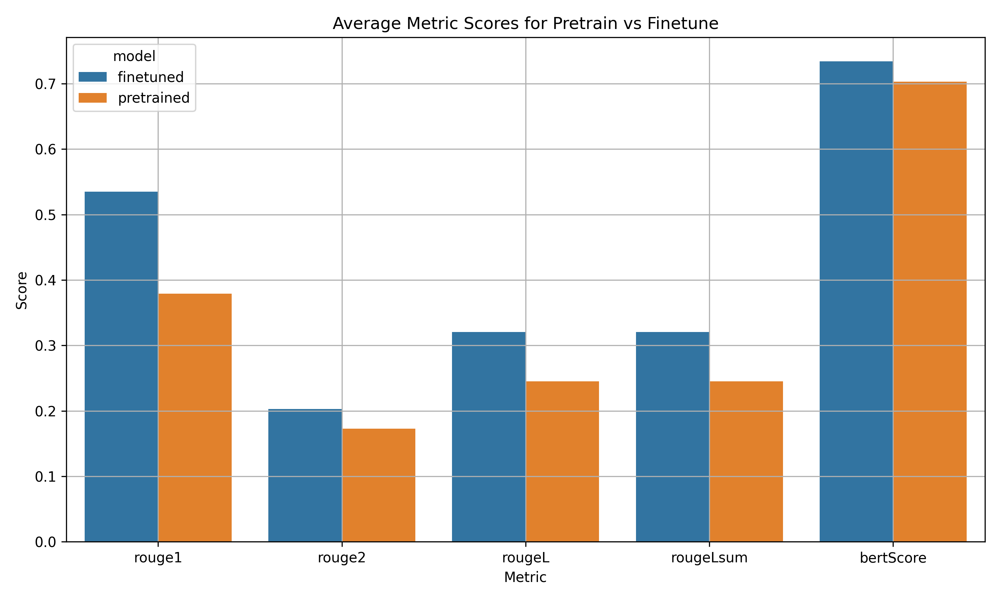

# Finetuning Qwen for News Summarization

---

## 🧠 Objective

This project focuses on fine-tuning a lightweight instruction-tuned language model, **Qwen2.5-0.5B-Instruct**, for the task of **Vietnamese news summarization**. The goal is to enable the model to generate concise and semantically accurate summaries from raw news content.

---

## 🏗️ Model & Fine-tuning Setup

- **Base Model**: [`unsloth/Qwen2.5-0.5B-Instruct-bnb-4bit`](https://huggingface.co/unsloth/Qwen2.5-0.5B-Instruct-bnb-4bit)
- **Approach**: LoRA (Low-Rank Adaptation) with 4-bit quantization using `bitsandbytes`
- **Prompt Format**:
  - Instruction-style input (`Content → Summary`)
  - Few-shot, task-specific formatting with system, user, and assistant messages
- **Why Qwen2.5-0.5B**:
  - Lightweight and efficient (0.5B parameters)
  - Long-context support (up to 8192 tokens)
  - Finetune-able on consumer-grade GPUs

---

## 🧑‍💻 Training Details

- **Environment**: Kaggle GPU (NVIDIA Tesla P100 16GB)
- **Libraries**: `Unsloth`, `transformers`, `bitsandbytes`, `peft`
- **Dataset**: [`nhantruongcse/summary-vietnamese-news`](https://huggingface.co/datasets/nhantruongcse/summary-vietnamese-news)
- **Subset Size**: 10,000 training samples, 2,000 test samples

### 🧾 Sample Prompt Template

```python
system_message = """Bạn là trợ lý AI có nhiệm vụ tóm tắt văn bản của người dùng cung cấp.

### Hướng dẫn trả lời:
Không dài dòng, giới hạn 100 từ
Không giải thích gì thêm, chỉ cần tóm tắt
"""

user_template = """Hãy tóm tắt văn bản dưới đây:

{Content}
"""

assistant_template = """{Summary}
"""
```

---

## 📉 Training Progress

| Epoch | Time |
|-------|-----------------------|
| 1     | 01:19:51               |

| Step | Training Loss |
|------|---------------|
|  30  | 2.493200      |
|  60  | 2.292400      |
|  90  | 2.273000      |
| 120  | 2.253500      |
| 150  | 2.237000      |
| 180  | 2.258400      |
| 210  | 2.231500      |
| 240  | 2.242900      |
| 270  | 2.233000      |
| 300  | 2.254700      |

- **Final Loss:** ~2.25
- **Estimated Perplexity:** exp(2.25) ≈ 9.5

## 🔍 Evaluate Pretrained and Finetuned Model Inference

### 🖼️ Visual Comparison

#### 🔷 Boxplot: Distribution of Evaluation Metrics


#### 🔶 Bar Chart: Average Scores by Metric


These plots demonstrate that the finetuned model consistently outperforms the pretrained model across all metrics.


## 📋 Statistical Test Results (Paired t-test)

| **Metric**     | **t-statistic** | **p-value** | **Significance**              |
|----------------|----------------:|------------:|-------------------------------|
| **ROUGE-1**     | 56.347          | 0.000       | ✅ Significant improvement     |
| **ROUGE-2**     | 12.732          | 0.000       | ✅ Significant improvement     |
| **ROUGE-L**     | 37.449          | 0.000       | ✅ Significant improvement     |
| **ROUGE-Lsum**  | 37.449          | 0.000       | ✅ Significant improvement     |
| **BERTScore**   | 30.142          | 0.000       | ✅ Significant improvement     |

> All metrics show statistically significant improvements after fine-tuning (**p < 0.001**).


## 📈 Analysis

The paired t-test confirms that fine-tuning yields **statistically significant performance gains** across all key summarization metrics:

- 🔹 **ROUGE-1 / ROUGE-2**: Improved n-gram overlap with reference summaries.
- 🔹 **ROUGE-L / ROUGE-Lsum**: Better sequence alignment and structural coherence.
- 🔹 **BERTScore**: Higher semantic similarity, showing the model better understands context and meaning.

These improvements demonstrate that the fine-tuned model produces **more accurate, fluent, and semantically faithful summaries** compared to the pretrained baseline.


## ✅ Conclusion

Fine-tuning the Qwen2.5-0.5B-Instruct model on Vietnamese news data has clearly enhanced its ability to generate high-quality summaries. The model shows significant improvements both statistically and visually, validating the effectiveness of the LoRA fine-tuning approach combined with 4-bit quantization.
