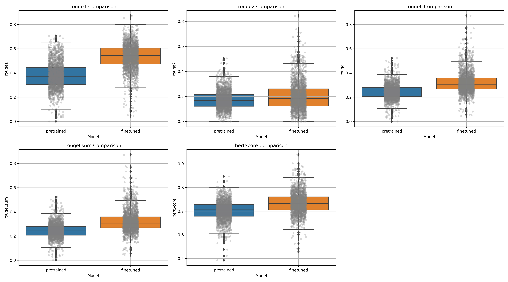
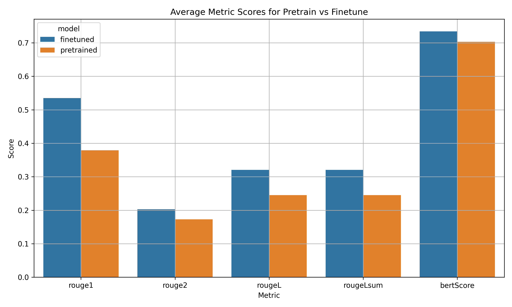

# Evaluate Pretrained and Finetuned Model Inference

---

## 📝 Overview

This analysis compares the summarization performance of a **pretrained model** versus a **finetuned version** using standard evaluation metrics. The goal is to assess how much improvement fine-tuning brings to the model's output quality.

## 🖼️ Visual Comparison

### 🔷 Boxplot: Distribution of Evaluation Metrics

### 🔶 Bar Chart: Average Scores by Metric

These plots demonstrate that the finetuned model consistently outperforms the pretrained model across all metrics.

## 📋 Statistical Test Results (Paired t-test)

| **Metric**     | **t-statistic** | **p-value** | **Significance**              |
|----------------|----------------:|------------:|-------------------------------|
| **ROUGE-1**     | 56.347          | 0.000       | ✅ Significant improvement     |
| **ROUGE-2**     | 12.732          | 0.000       | ✅ Significant improvement     |
| **ROUGE-L**     | 37.449          | 0.000       | ✅ Significant improvement     |
| **ROUGE-Lsum**  | 37.449          | 0.000       | ✅ Significant improvement     |
| **BERTScore**   | 30.142          | 0.000       | ✅ Significant improvement     |

> All metrics show statistically significant improvements after fine-tuning (**p < 0.001**).

## 📈 Analysis

The paired t-test confirms that fine-tuning yields **statistically significant performance gains** across all key summarization metrics:

- 🔹 **ROUGE-1 / ROUGE-2**: Improved n-gram overlap with reference summaries.
- 🔹 **ROUGE-L / ROUGE-Lsum**: Better sequence alignment and structural coherence.
- 🔹 **BERTScore**: Higher semantic similarity, showing the model better understands context and meaning.

These improvements demonstrate that the fine-tuned model produces **more accurate, fluent, and semantically faithful summaries** compared to the pretrained baseline.

## ✅ Conclusion

Fine-tuning substantially enhances the model's summarization capabilities in both syntactic precision and semantic understanding. This validates the effectiveness of the fine-tuning process in adapting the model to specific summarization tasks.

